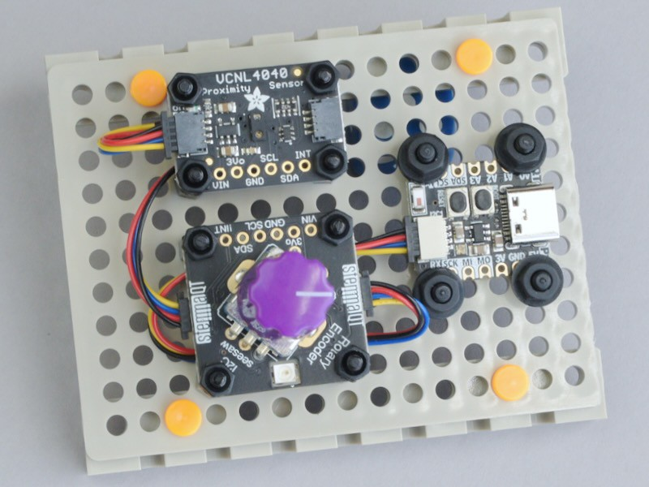
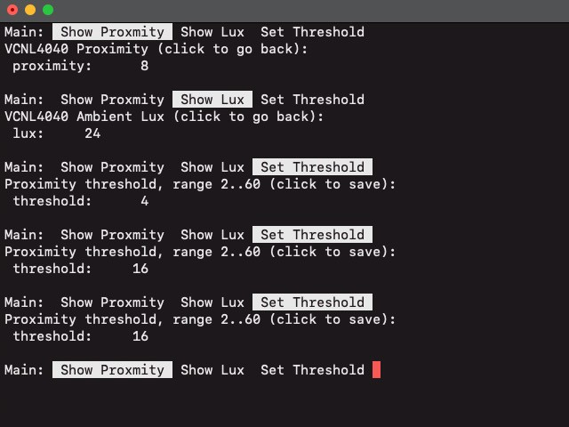

<!-- SPDX-License-Identifier: MIT -->
<!-- SPDX-FileCopyrightText: Copyright 2024 Sam Blenny -->
# Proximity Sensor with Rotary Encoder Menu

This demonstrates how to add a simple menu system to your project using a
single rotary encoder for input and the serial console for output.




## Hardware: Parts and Tools

- Adafruit QT Py ESP32-S3 with 8MB Flash and no PSRAM
  ([product page](https://www.adafruit.com/product/5426),
  [learn guide](https://learn.adafruit.com/adafruit-qt-py-esp32-s3))

- Adafruit I2C Stemma QT Rotary Encoder Breakout with Encoder
  ([product page](https://www.adafruit.com/product/5880),
  [learn guide](https://learn.adafruit.com/adafruit-i2c-qt-rotary-encoder))

- Adafruit VCNL4040 Proximity and Lux Sensor
  ([product page](https://www.adafruit.com/product/4161),
  [learn guide](https://learn.adafruit.com/adafruit-vcnl4040-proximity-sensor))

- Adafruit Violet Micro Potentiometer Knob - 4 pack
  ([product page](https://www.adafruit.com/product/5537))

- 2x Adafruit STEMMA QT / Qwiic JST SH 4-pin Cable - 100mm
  ([product page](https://www.adafruit.com/product/4210))

- Tamiya Universal Plate Set #70157
  (3mm thick, 160x60mm ABS plates with 3mm holes on 5mm grid)

- M2.5 Nylon Standoff Set
  (misc. M2.5 machine screws, standoffs, and nuts)

- M3 Nylon Standoff Set
  (misc. M3 machine screws, nuts, and washers)

- 1.5mm or 2mm Allen wrench or hex bit
  (available in
  [Adafruit #5473](https://www.adafruit.com/product/5473),
  [Adafruit #829](https://www.adafruit.com/product/829), or
  [iFixit Pro Tech Toolkit](https://www.ifixit.com/products/pro-tech-toolkit),
  etc.)


## Using the Rotary Encoder Menu

Once you've assembled the hardware and installed all the code, `code.py` will
start sending the main menu to the serial console. The menu uses ANSI escape
codes to show your current menu selection in reverse video. To change
selections, turn the encoder knob. To perform the action for your current
selection, click the knob.

There are three menu items:

- "Show Proximity": when clicked, this will show the VCNL4040's proximity
  sensor measurement until you click the encoder knob to return to the main
  menu. Turning the knob in this mode has no effect.

- "Show Lux": when clicked, this will show the VCNL4040's ambient illumination
  sensor measurement until you click the encoder knob to return to the main
  menu. Turning the knob in this mode has no effect.

- "Set Threshold": when clicked, this changes the integer value of the
  proximity threshold setting in the context dictionary. Turning the knob
  updates the threshold immediately, subject to the high and low range limits.
  A proximity value of `2` means a reflective object is about 150 mm to 200 mm
  away from the sensor. A value of `5` is in the neighborhood of 100 mm to
  110 mm, and a value of 60 is about 10 mm. Clicking the knob returns to the
  main menu.

The proximity threshold controls the QT Py ESP32-S3's Neopixel. If you put a
reflective object in front of the sensor at or below the threshold distance,
the Neopixel will light up. When you take the object away, the Neopixel will
turn off. The Neopixel updates work in the main menu and the menu-item modes.

This is a screenshot of a serial console window where I was navigating through
the menus using the rotary encoder:




## Understanding Menu System Code

The actions for each selection item of the main menu correspond to a function
defined in `code.py`. The menu structure and some other global state are stored
in a context dictionary called `ctx`, which looks like this:

```
# The context dictionary holds shared data used by several
# functions. You could use a class or individual variables for
# this. But, for simple prototyping, a dictionary makes it easy
# to try ideas quickly without typing lots of boilerplate code.
# You can read about declaring dictionary literals at:
#   https://docs.python.org/3/library/stdtypes.html#dict
#
# For the menu item list, each entry should be a tuple of
# (name, callable object). The name gets used by the function
# that prints the current menu selection. The callable object
# gets used when you pick a menu item. In Python, functions and
# methods are callable objects. You can call them with a `()`
# after their name, or you can assign them to variables by
# omitting the `()`.
#
ctx = {
    'menu': [             # Navigation menu
        ('Show Proxmity', showProx),
        ('Show Lux',      showLux),
        ('Set Threshold', setThresh),
    ],
    'enc': enc,           # Encoder object for submenus to use
    'vcnl': vcnl,         # VCNL4040 object for submenus to use
    'np': np,             # Neopixel pin (DigitalInOut)
    'newline': True,      # Should menu start on a new line?
    'selection': 0,       # Menu selection index
    'threshold': 4,       # Proximity threshold (range 2..60)
}
```

The main event loop looks like this:

```
prevClick = False
while True:
    sleep(0.03)  # poll at 30 Hz so knob feels responsive
    showMenu('Main', ctx)
    # Read the rotary encoder
    click = enc.clicked()
    delta = enc.delta()
    # Handle knob click (edge trigger on pressed -> released)
    if (not click) and (click != prevClick):
        doAction(ctx)
    prevClick = click
    # Handle knob turn
    if delta != 0:
        select(delta, ctx)
    # Update LED
    updateNeopixel(ctx)
```

The `showMenu()` function prints the current selection (`ctx['selection']`).
The `doAction()` function uses the selection and the menu list (`ctx['menu']`)
to call the appropriate handler function when the encoder knob is clicked.

The menu action handler functions, `showProx()`, `showLux()`, and
`setThresh()`, each have an event loop similar to the main event loop. But, for
the handler functions, rotary encoder input is used to stop showing sensor
readings and return to the main menu (`showProx` and `showLux`) or to edit the
integer value of a setting (`setThresh`).


## Assembling the Hardware

1. Attach Qt Py to backplate with M3 machine screws, nuts, and washers

2. Attach knob to rotary encoder shaft. You will need a small Allen wrench or
   hex bit to tighten the knob's set screw. Before tightening the set screw, be
   sure there is a small gap between the bottom of the knob and the threads of
   the encoder housing. If the knob is bottomed out, it will be hard to turn.

3. Connect rotary encoder to the QT Py with a STEMMA QT cable

4. Attach rotary encoder to backplate with M2.5 standoffs, machine screws, and
   nuts

5. Connect proximity sensor to the rotary encoder with a STEMMA QT cable

6. Attach proximity sensor to backplate with M2.5 standoffs, machine screws,
   and nuts


## Updating CircuitPython

1. Download the CircuitPython 9.1.1 .UF2 file from the
   [Adafruit QT Py ESP32-S3 No PSRAM](https://circuitpython.org/board/adafruit_qtpy_esp32s3_nopsram/)
   page on circuitpython.org

2. Follow the instructions in the
   [CircuitPython Quickstart](https://learn.adafruit.com/adafruit-qt-py-esp32-s3/circuitpython-2#circuitpython-quickstart-3106398)
   section of the Adafruit QT Py ESP32-S3 learn guide to update your board with
   CircuitPython 9.1.1


## Installing CircuitPython Code

To copy the project bundle files to your CIRCUITPY drive:

1. Download the project bundle .zip file using the button on the Playground
   guide or the attachment download link on the GitHub repo Releases page.

2. Expand the zip file by opening it, or use `unzip` in a Terminal. You should
   end up with a folder named prox-sensor-encoder-menu, which should contain a
   `README.txt` file and a `CircuitPython 9.x` folder.

3. Open the CircuitPython 9.x folder and copy all of its contents to your
   CIRCUITPY drive.

To learn more about copying libraries to your CIRCUITPY drive, check out the
[CircuitPython Libraries](https://learn.adafruit.com/welcome-to-circuitpython/circuitpython-libraries)
section of the
[Welcome to CircuitPython!](https://learn.adafruit.com/welcome-to-circuitpython)
learn guide.
